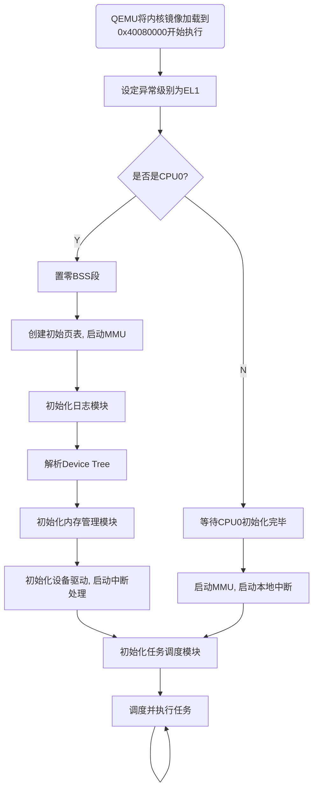

# 面向鲲鹏处理器的
# 简单操作系统设计与实现

李冬冬 17281182

---
layout: intro
---

# 大纲

* 研究基础
  * 鲲鹏处理器
  * ARMv8-A架构
  * Rust语言
* 内核设计
  * 架构总体设计
  * 启动流程
  * 进程管理与处理器调度
  * 系统内存管理
  * 进程内存管理
* 原型测试与结果分析
* 总结与展望

<style>
.slidev-page-2 .my-auto {
  background: rgb(62, 81, 102);
}
</style>

---
layout: image-right
image: /kunpeng.jpg
---

# 鲲鹏处理器

鲲鹏处理器是华为近年来推出的数据中心高性能处理器，兼容 Armv8 架构，由华为自主研发和设计，旨在满足数据中心多样性计算、绿色计算需求。

鲲鹏920兼容ARMv8架构和ARM GIC、SMMU、RAS、PCIe、SAS、SATA等标准。

---
layout: image-right
image: /arm.png
---

# ARMv8-A

AArch64 是 ARMv8-A 架构中引入的 64 位运行状态和指令集，也叫 ARM64。AArch64 指令集，支持地址长度为 64 位，有 x0~x30 共 31 个 64 位通用寄存器。支持四种异常模式 EL0~EL3，用户程序运行在 EL0，操作系统内核运行在 EL1。

ARMv8的架构在EL1提供了两个页表寄存器，TTBR0和TTBR1，每个寄存器都可以指向物理内存中的一个全48位的页表结构。两个页表寄存器对应的地址空间一个用于用户，一个用于内核。

---
layout: two-cols
---

# Rust

Rust语言是一门初露锋芒的兼具高性能、可靠性和生产力的系统级语言。由于其内存安全、无 GC、零成本抽象等特性，能安全高效地开发操作系统。

目前已有多个操作系统项目使用了Rust：
* 谷歌的Fuchsia使用Rust开发了除Zircon内核外大部分组件；
* Android将使用Rust重写蓝牙栈；
* Linux内核将可以使用Rust开发驱动。

::right::

```rust
#[no_mangle]
unsafe extern "C" fn main_start() -> ! {
    let device_tree_addr: usize;
    asm!("mov {}, x23", out(reg) device_tree_addr, options(pure, nomem, nostack));

    crate::logging::init();

    let device_tree = drivers::DeviceTree::from_raw(device_tree_addr).unwrap();
    log_system_info(&device_tree);
    memory::init(memory::MemInitOpts::new(
        device_tree.probe_memory().unwrap(),
    ));

    let device_tree = drivers::DeviceTree::from_raw(phys_to_virt(device_tree_addr)).unwrap();
    let mut buf = Vec::<u8>::with_capacity(device_tree.totalsize());
    buf.extend_from_slice(device_tree.device_tree().buf());
    let device_tree = drivers::DeviceTree::new(buf.as_slice()).unwrap();

    crate::task::init(bsp::CPU_NUM);
    interrupt::init(device_tree);

    // async_test();
    AP_CAN_INIT.store(true, Ordering::Release);
    crate::kmain();
}
```

<br/>

<div class="absolute bottom-4 left-12 bg-white px-2 rounded-full">
  
  
  
  
</div>

---
layout: image-right-contain
image: /kernel.png
---

# 内核架构

本内核在总体设计上，参考了Linux内核，采用宏内核的组织方式，将内核打包成一个可执行二进制文件，由引导程序引导运行。

已实现的主要模块有：进程管理；内存管理；文件系统；设备驱动。

---
layout: two-cols
---

# 内核启动流程

内核启动时，由CPU0执行大部分初始化操作，然后唤醒其他CPU。

内核一开始创建一个简单的页表，启动MMU；然后解析设备树获取硬件信息。

内存管理模块的初始化包括初始化伙伴系统和SLAB分配器，创建新的页表重新映射内核虚拟地址空间。

内核根据解析到的硬件信息初始化各个设备驱动和中断控制器，并启用中断。

最后内核唤醒其他CPU，初始化任务调度模块，开始调度并执行任务。

::right::



---

# 进程与线程

进程是对正在运行程序的一个抽象，是程序在执行过程中分配和管理资源的基本单位，每个进程有自己单独的地址空间。进程所维护的资源和信息包括：进程ID、进程组ID；一系列内存区域（可执行文件、栈、堆、内存映射）组成的虚拟内存；打开的文件；父进程和子进程；进程自身包含的线程；信号队列等。

线程是任务调度和执行的基本单位，一个进程可以拥有多个线程，同一个进程下的线程共享一个地址空间，但都有自己独立的运行栈和程序计数器（PC）。线程所维护的数据有：线程ID；所属进程；线程信号队列等。

---
layout: image-right-contain
image: task.png
---

# 任务

在常规的操作系统内核中，线程是处理器调度和执行的基本单位，而线程又可分为内核线程（内核自己派生的线程，运行在内核态）和用户线程（用户进程创建的线程，运行在用户态）。

本文选择使用任务（实现了Future特性的协程）来作为处理器调度的执行的基本单位。相对应的，内核任务不需要有对应的线程；用户任务则根据用户线程派生，但在用户程序的层面上，内核仍然提供用户线程的抽象保证（参照右图）。

---
layout: two-cols
---

# Rust异步机制

Rust异步机制的核心是`Future`特性（trait），其中`poll`方法是`Future`的核心，它是对轮询行为的抽象，每个`Future`都需要调用`poll`方法来轮询状态。

该方法的返回值`Poll`是一个枚举类型，`Poll<T>`枚举类型包含了两个枚举值，`Ready(T)`和`Pending`。两者对应准备好和未完成两种状态，以此来表达`Future`的结果。

`Future`只是基本的异步计算抽象，具体执行还需要两个部件——`Executor`和`Task`——来完成。`Task`是实现了`Future`抽象的具体异步任务；`Executor`是任务调度器，用于调度执行具体的任务。

::right::

```rust {all|2|4-7|10-13|all}
pub trait Future {
    type Output; // 最终的输出

    pub fn poll(
        self: Pin<&mut Self>,
        cx: &mut Context<'_> // 其中包含了Waker
    ) -> Poll<Self::Output>;
}

pub enum Poll<T> {
    Ready(T),
    Pending,
}
```

```rust {all|5|6-10|11|all}
impl Executor {
  pub fn run(&self) {
    let run_queue = self.run_queue.clone();
    loop {
        let (_,task,runnable)=run_queue.lock().pop_task_to_run();
        let is_yielded = runnable.run();
        let mut run_queue = run_queue.lock();
        if !is_yielded { // if it not yielded then remove it.
            run_queue.remove_task(task.lock());
        }
        run_queue.task_tick(task.lock());
    }
}
}
```

---
layout: two-cols
---

# 任务实现

用户任务执行时，首先会根据用户线程保存的上下文信息，从内核态转入用户态开始执行用户程序；
当任何异常（系统调用、中断等）发生时，让出控制流，由`Executor`选择下一个任务执行。

这种实现机制结合了协作式和抢占式，用户任务既可以自己让出控制流，如执行I/O操作等系统调用；也可以在中断执行完毕后让`Executor`决定是否被抢占。但是在用户程序层面上仍然是抢占式抽象。

::right::

```rust {all|1|2|3-4|5-16|17-21|all}
let future = async move {
    loop {
        let mut thread_context = thread.begin_running();
        thread_context.run();
        let trap_num = thread_context.trap_num;
        let mut exit = false;
        let mut do_yield = false;
        match trap_num {
            _ if is_page_fault(trap_num) => ...
            _ if is_syscall(trap_num) => ...
            _ if is_irq(trap_num) => ...
            _ => ...
        }
        if !exit {  // check signals
            exit = handle_signal(&thread, &mut thread_context);
        }
        if exit {
            break;
        } else if do_yield {
            yield_now().await;
        }
    }
};
let (task, sched_task) = executor::local_executor().spawn(future);
```

---

# 完全公平调度

完全公平调度器（Completely Fair Scheduler，CFS）和以往的调度器不同之处在于没有时间片的概念，取而代之的是分配CPU使用时间的比例。

它的基本原理是：设定一个调度周期，目标是让每个任务在这个周期内至少有机会运行一次，换言之，每个进程等待CPU的时间最长不超过这个调度周期；然后根据进程的数量和优先级，划分这个调度周期的CPU使用权。

CFS为了保证每一个任务的完全公平调度，引入了虚拟运行时间的概念，虚拟运行时间和实际运行时间的转换公式为：虚拟运行时间 = 实际运行时间 * 默认任务权重 / 任务权重。这样，CFS只需要保证每一个任务获得执行的虚拟运行时间一致即可，哪个任务的累计虚拟运行时间最少，哪个任务就优先调度。

---
layout: image-right-contain
image: /cfs_tick.png
---

# 完全公平调度

在内核中，每个CPU都有一个`Executor`，负责任务的执行和调度，其维护着一个就绪队列，该队列按任务的虚拟运行时间排序。每个`Executor`有一个最小虚拟运行时间，一般情况下总是等于就绪队列中最小的任务虚拟运行时间。因为存在多个`Executor`，内核还支持任务窃取功能。

`Executor`的执行函数就是一个不断调用`tick`方法的无限循环。在选择任务时，首先判断就绪任务数是否小于2，如果是，则尝试从别的`Executor`窃取任务。然后根据当前任务的状态和信息判断是否需要抢占当前任务，为了防止频繁地抢占任务，当执行时间小于最小粒度时间时当前任务不会被抢占。

---
layout: image-right-contain
image: /buddysystem.png
---

# 伙伴系统

伙伴系统将所有空闲页面分成多个块链表（默认为11个），每个链表中的一个内存块含有2的幂次个页面。

如果分配阶为n的内存块，先从第n个块链表中查找是否有空闲块。如果有则分配，否则在第n+1个块链表中查找，直到找到为止。如果找到的空闲块的大小大于所请求块的大小，则需要对其进行分裂，然后将分裂后的空闲块插入对应的块链表中。

块的释放是分配的逆过程，释放时如果在对应的块链表中找到其伙伴，则将其合并后插入上一级块链表，以此类推，直至到达最大块链表。

---

# SLAB分配器

物理内存管理采用了以页为单位的伙伴系统，但很多情况下，内核仅仅需要一个较小的对象，所以需要类似用户空间堆内存的管理机制（`malloc`/`free`）。

然而内核对象的管理又有一定的特殊性：
* 有些对象的创建释放访问非常频繁，需要采用缓存机制；
* 对象的组织需要是CPU缓存友好的；
* 需要尽量避免内部或外部碎片；
* 需要适配多处理器和NUMA架构。

Slab分配器对外暴露的接口主要是分配和释放两个操作，因为情况的不同在执行操作时会进入不同的执行路径，分配器的主要设计目标就是尽可能地执行快速路径。

---
layout: image-right-contain
image: /slab_overall.png
---

# SLAB分配器

每个SLAB分配器（`MemCache`）只分配固定大小的内存，称之为对象，分配器维护着一组slab，一个slab由若干个连续页面组成，每个页面被划分成若干个大小一样的对象（存在无法整除的情况，多余的被称为碎片）。

`MemCache`保存着有关该分配器的一些配置信息：对象大小，slab包含的页面数等。另外两个主要组成部分是每CPU数据结构（`MemCacheCpu`），以及空闲slab链表。

---
layout: image-right-contain
image: /slab.png
---

# SLAB

Slab管理结构和slab本身属于两块独立的内存。每个slab被分为若干个固定大小的对象，每个未分配对象（free object）在其头部保存着一个指针，指向下一个未分配对象。

在slab管理结构中维护着第一个未分配对象（`freelist`字段），这样就组成了一个单向链表以供使用。

slab管理结构中还维护着一些信息：
* `inuse`：已分配对象数量；
* `objects`：对象总数；
* `frozen`：当前slab是否存在于`MemCacheCpu`中。

---
layout: image-right-contain
image: /slab_cpu.png
---

# MemCacheCpu

MemCache中的每CPU数据结构维护着三个链表，其中两个是空闲对象链表，一个是空闲slab链表。

两个空闲对象列表中的对象来自同一个slab，但两个列表互相独立，slab的空闲对象列表中对象来源于其他CPU的释放操作。

这样组织的目的是尽可能地执行CPU本地的操作，避免数据竞争（data race）。

---
layout: image-right-contain
image: slab_allocation_fast.png
---

# SLAB分配

执行分配操作时，首先从当前CPU的空闲对象列表里面分配。这里执行的是CAS（compare and swap）原子操作，因此可以不用关闭中断。

---
layout: image-right-contain
image: /slab_allocation_slow.png
---

# SLAB分配

如果分配未成功，则判断当前CPU slab的空闲对象列表是否存在空闲对象，如存在则转移到CPU 空闲对象列表。

否则，再试图从当前CPU空闲slab列表中获取一个slab。

这两种情况都需要关闭中断，以避免发生任务抢占，但关闭中断之后则无需使用原子操作。

---
layout: image-right-contain
image: /slab_allocation_slowest.png
---

# SLAB分配

最后，如果依旧分配未成功，则需要从总分配器的空闲slab列表中尝试获取一个空闲的slab；如果无法获取，则从页分配器请求若干页面创建一个新的slab以供使用。

这两个操作需要上锁，因此是最慢的路径，但同时也是相对最不可能执行的路径，所以锁的开销可以接受。

---
layout: image-right-contain
image: /slab_free_fast.png
---

# SLAB释放

对象释放时，首先根据对象地址找到对应的slab。如果对象所属slab恰好是当前CPU维护的slab，则直接释放到当前CPU的空闲对象列表中。

---
layout: image-right-contain
image: /slab_free_slow.png
---

# SLAB释放

否则，释放到对应slab的空闲对象列表中。
该slab可能处于几种状态中：
* 是另一个CPU的CPU slab；
* 在某个CPU的空闲slab列表中；
* 在分配器的全局空闲slab列表中；
* 由于之前所有对象已经完全被分配，哪个空闲slab列表也不属于。

对象释放操作操作全局空闲slab列表（插入或删除slab）需要对其上锁，在其他场景下只需要对相应slab的空闲对象列表执行原子操作。

---

# ABA问题

尽管原子操作能以较低的开销执行并发操作，避免锁的使用，但一般的CAS操作的潜在问题是会遇到“ABA问题”。所谓“ABA问题”是指当一个线程把共享数据从A改为B再改为A时，另一个执行CAS操作的线程并不能分辨出该数据是否被修改过，这在有些时候会产生错误。

本内核参考Linux内核的解决方式，使用128位CAS原子操作来尽可能地避免“ABA问题”，128位中64位为数据指针，另外64位为版本号。每执行一次CAS操作版本号就递增一次，这样即使数据指针被修改为原值也能被检测到。

较新的x86-64和ARM架构处理器都支持128位CAS原子操作。

---
layout: image-right-contain
image: /slab_benchmark.png
---

# 性能测试

SLAB分配器的性能测试中，本内核实现与另外三种实现比较：系统堆分配器；无锁SLAB分配器实现；使用了全局锁的SLAB分配器实现。

测试程序首先使用堆分配一块连续内存供SLAB分配器使用；然后创建四个线程模拟四个CPU核心；四个线程分别连续执行若干次分配操作，再连续执行若干次释放操作；以充分模拟并行内存释放环境。

从结果可以看到，执行时间和分配请求数量成正比，而本SLAB分配器实现（my_slab）和系统堆分配器(heap)及其他无锁SLAB分配器(sharded_slab)实现性能不相上下，与使用全局锁的实现相比性能提升显著。

---
layout: image-right-contain
image: /address_space.png
---

# 进程虚拟地址空间

虚拟地址空间中包含了若干区域，其分布大致如下：
* 当前运行程序的二进制代码，所处的虚拟内存区域称为text段。
* 程序使用的动态库的代码。
* 存储全局变量和动态产生的数据的堆。
* 用于保存局部变量和实现函数/过程调用的栈。
* 环境变量和命令行参数的段。
* 将文件内容映射到虚拟地址空间中的内存映射。

---
layout: two-cols
---

# 设备驱动与中断处理

本内核实现了一种简单的设备驱动程序抽象：一个设备驱动需要定义自己的兼容名、初始化函数、中断处理函数和设备类型。

中断管理器还包含另外两个方法，注册和启动特定中断和处理等待中断。

在内核启动时，内核获取到设备树信息，根据每个设备驱动的兼容名获取对应信息，初始化设备驱动，注册并启用特定中断号的中断。当中断发生时，中断管理器负责根据中断号查找到相关设备驱动，调用其中断处理函数。

::right::

```rust
pub trait Driver: Send + Sync {
    /// Return a compatibility string for identifying the driver.
    fn compatible(&self) -> &'static str;

    /// Called by the kernel to bring up the device.
    fn init(&self) -> Result<()> {
        Ok(())
    }

    fn handle_interrupt(&self) {}

    /// return the correspondent device type
    fn device_type(&self) -> DeviceType;
}

pub trait IrqManager: Driver {
    /// Register and enable interrupt controller local irq
    fn register_and_enable_local_irq(&self, irq_num: usize, driver: Arc<dyn Driver>) -> Result<()>;

    fn handle_pending_irqs(&self);
}
```

---

# 虚拟文件系统

虚拟文件系统（Virtual File System）是用户进程和文件系统实现之间的一个抽象层，用来提供一种操作文件、目录和其他对象的统一方法。

在处理文件时，内核空间和用户空间使用的主要对象不同。对用户程序来说，一个文件由一个文件描述符标识，该描述符是一个整数，在所有有关文件的操作中用作标识文件的整数。文件描述符在打开文件时由内核分配，只在一个进程内部有效。

内核处理文件的关键是inode。每个文件（包括目录）都有且只有一个对应的inode，其中包含元数据（如访问权限、修改日期等）和指向文件数据的指针。文件系统使用inode来构建和维护目录层次结构。

---

# 系统调用接口

系统调用（System Call）用于从用户应用程序调用内核例程，以利用内核一些专门的功能。这些系统调用通常包括进程管理，时间操作，信号处理，调度，文件系统，内存管理等功能。本内核实现了有关进程管理，文件系统和时间操作的部分系统调用。

ARMv8架构支持SVC（SuperVisor Call）指令，用户程序可以使用这个指令触发一个异常，这样程序从非特权模式进入特权模式，交由操作系统处理。每个系统调用有一个专门的系统调用号，和0到5个不等的若干参数。在调用SVC指令时，使用X8寄存器指定系统调用号，X0~X4传递参数。

---

# 内核运行截图

内核启动后可以正确解析设备树并初始化相关模块，打印系统信息。


---

# 工作总结与展望

面向鲲鹏处理器，基于ARMv8架构设计并使用Rust语言实现了一个简单的操作系统内核，主要包括内存管理、进程调度与管理、设备驱动、文件系统、系统调用等功能。本内核在整体上参考了Linux内核最新的设计与实现，但尚未做到完全实现所有特性，还在任务机制部分探索了协程在操作系统内核中的应用。

在内核开发过程中，遇到过死锁，编译器版本改变导致的可执行文件生成错误等问题，还有许多大大小小的Bug。通过使用GDB调试反编译等方法，逐步解决了这些问题。在过程中，锻炼了自己发现问题定位问题解决问题的能力。

未来需要做的工作还有很多。对于已实现部分，还需要做进一步正确性功能性测试和性能优化。此外还有许多操作系统内核相关的功能待实现，包括缓存机制，网络栈，更精细的多核任务调度等等。对于协程在操作系统内核中的应用，还需要参考其他人在此方面的成果，进一步探索。

---
layout: intro
---

# 谢谢各位老师，请老师批评指正

